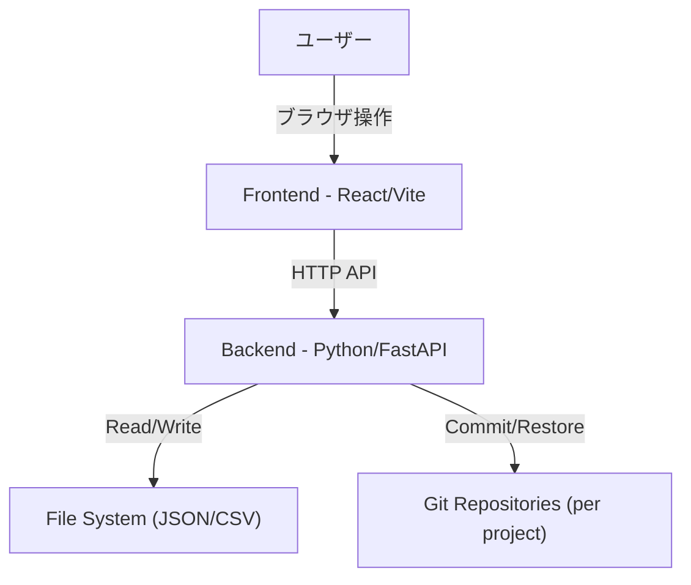
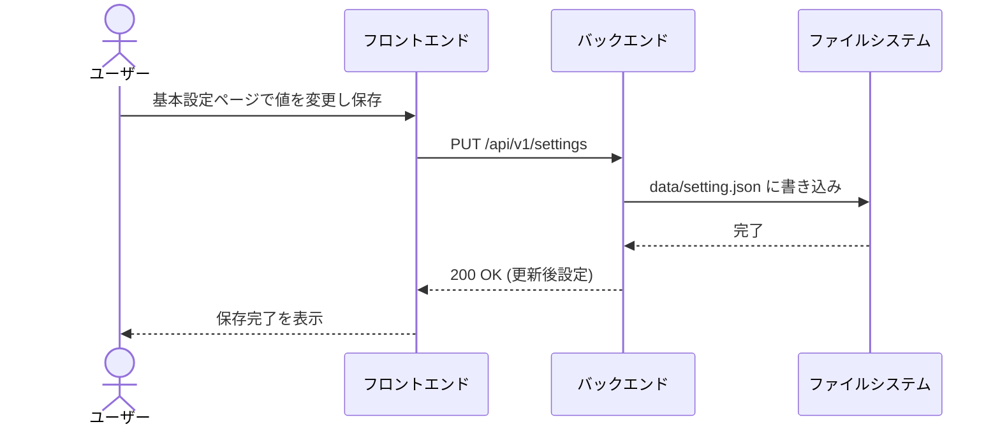
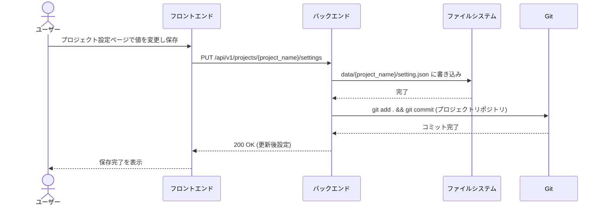
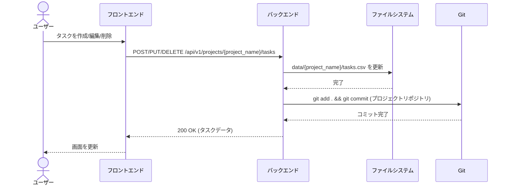
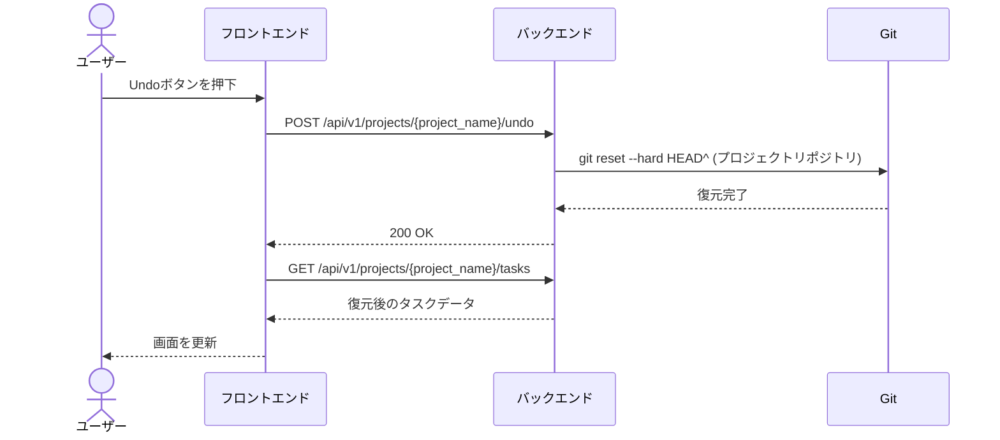
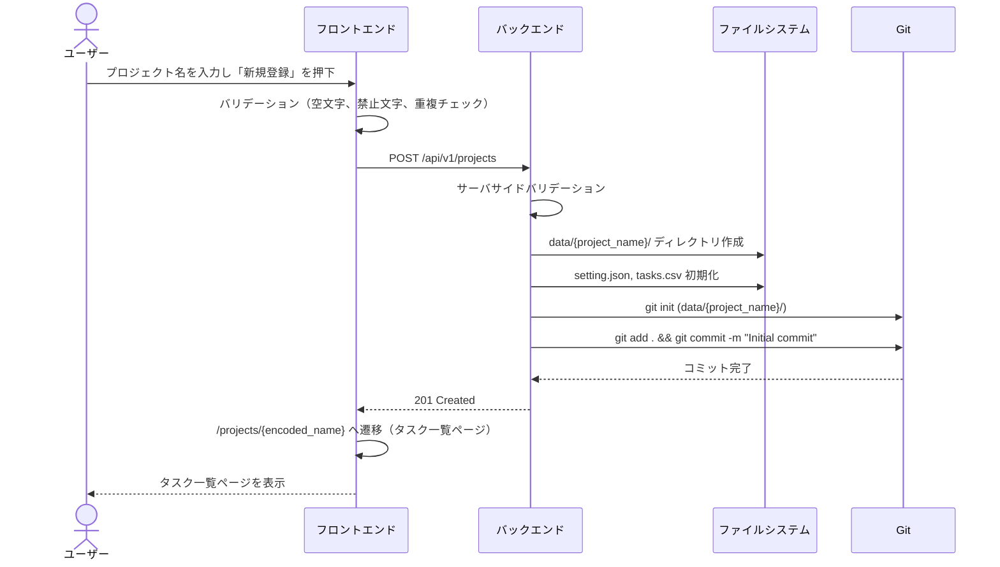

# システム設計

## 1. システム概要

### 1.1 背景・目的

- **背景**: オフラインで利用可能かつGitによる履歴管理を行いたいというニーズへの対応。
- **目的**: ファイルベース(JSON/CSV)のデータ管理とGitによる履歴管理を組み合わせた、堅牢かつシンプルなプロジェクト管理ツールの実現。

### 1.2 スコープ

- **対象範囲**: 本システム（Frontend, Backend）およびローカルデータストア
- **対象外**: リモートリポジトリ連携（機能としてはGitを使用するが、リモート同期はユーザーの任意操作とする）

### 1.3 システム構成



### 1.4 ディレクトリ構成

```
data/
  setting.json          # グローバル基本設定（Git管理対象外）
  <プロジェクト名>/
    .git/               # プロジェクト固有のGitリポジトリ
    setting.json         # プロジェクト固有設定（Git管理対象）
    tasks.csv            # プロジェクト固有タスクデータ（Git管理対象）
```

## 2. 環境

- **開発言語**: TypeScript (Frontend), Python 3.12+ (Backend)
- **フレームワーク**: React (Frontend), FastAPI (Backend)
- **データベース**: なし (JSON/CSVファイルを使用)
- **インフラ**: Dockerコンテナでの動作をサポート、またはローカルPC上で直接実行。データおよび履歴の永続化のため、Dockerボリュームを使用する。

## 3. 機能要件

### 3.1 設定管理 (CNFG)

- **実現方針**
  - グローバル基本設定はJSON形式で `data/setting.json` に保存する。Git管理対象外。
  - プロジェクト固有設定はJSON形式で `data/<プロジェクト名>/setting.json` に保存する。Git管理対象。
  - Pydanticモデルを用いてバリデーションを行い、不正な設定値の混入を防ぐ。

- **シーケンス図（基本設定の保存）**



- **シーケンス図（プロジェクト設定の保存）**



- **要件一覧**
  | Spec-ID | 機能分類 | 機能名 | 項目名 | 内容 | 備考 |
  | :--- | :--- | :--- | :--- | :--- | :--- |
  | **SPEC-CNFG-001-001** | Config | グローバル基本設定 | ファイル保存 | `data/setting.json` にJSON形式で保存する。Git管理対象外。 | REQ-CNFG-001, REQ-DATA-003 |
  | **SPEC-CNFG-001-002** | Config | グローバル基本設定 | モデル定義 | `BasicSettings` クラスを定義し、タスク状態・種別・担当者等を管理する。 | REQ-CNFG-001 |
  | **SPEC-CNFG-001-003** | Config | グローバル基本設定 | API | `GET /api/v1/settings` および `PUT /api/v1/settings` でグローバル基本設定の取得・更新を行う。 | REQ-CNFG-001 |
  | **SPEC-CNFG-002-001** | Config | プロジェクト設定 | ファイル保存 | `data/<プロジェクト名>/setting.json` に保存する。Git管理対象。 | REQ-CNFG-002, REQ-DATA-002 |
  | **SPEC-CNFG-002-002** | Config | プロジェクト設定 | オーバーライド | グローバル基本設定の値をプロジェクト単位で上書き可能とする。 | REQ-CNFG-002 |
  | **SPEC-CNFG-002-003** | Config | プロジェクト設定 | API | `GET /api/v1/projects/{project_name}/settings` および `PUT /api/v1/projects/{project_name}/settings` でプロジェクト設定の取得・更新を行う。変更時はGitコミットする。 | REQ-CNFG-002, REQ-HIST-001 |

### 3.2 タスク管理 (TASK)

- **実現方針**
  - タスクデータは `pandas` DataFrameを用いて処理し、プロジェクトディレクトリ内のCSVファイルとして保存する。
  - タスクIDはUUID v4を使用し、一意性を担保する。
  - 階層構造は各タスクデータが持つ `parent_id` によって表現し、フロントエンド側でツリー構造に再構築して表示する。
  - 全タスクAPIはプロジェクト名をパスパラメータとして受け取る。

- **シーケンス図（タスク操作）**



- **要件一覧**
  | Spec-ID | 機能分類 | 機能名 | 項目名 | 内容 | 備考 |
  | :--- | :--- | :--- | :--- | :--- | :--- |
  | **SPEC-TASK-001-001** | Task | タスク一覧 | API | `GET /api/v1/projects/{project_name}/tasks` で指定プロジェクトの全タスクデータをCSVから読み込み返却する。 | REQ-TASK-001 |
  | **SPEC-TASK-001-002** | Task | タスク一覧 | フィルタ | クエリパラメータまたはフロントエンドでステータス・担当者等のフィルタを行う。 | REQ-TASK-001 |
  | **SPEC-TASK-002-001** | Task | タスクデータ | データ形式 | タスクは `data/<プロジェクト名>/tasks.csv` に保存される。 | REQ-TASK-004, REQ-DATA-002 |
  | **SPEC-TASK-002-002** | Task | タスク作成 | ID生成 | 新規作成時にUUID v4を自動生成してIDとする。 | REQ-TASK-002 |
  | **SPEC-TASK-002-003** | Task | タスク作成 | API | `POST /api/v1/projects/{project_name}/tasks` でタスクを新規作成する。作成後にGitコミットする。 | REQ-TASK-002, REQ-HIST-001 |
  | **SPEC-TASK-002-004** | Task | タスク編集 | API | `PUT /api/v1/projects/{project_name}/tasks/{task_id}` でタスクを更新する。更新後にGitコミットする。 | REQ-TASK-002, REQ-HIST-001 |
  | **SPEC-TASK-002-005** | Task | タスク削除 | API | `DELETE /api/v1/projects/{project_name}/tasks/{task_id}` でタスクを削除する。削除後にGitコミットする。 | REQ-TASK-001, REQ-HIST-001 |
  | **SPEC-TASK-003-001** | Task | 階層構造 | データ構造 | `parent_id` カラムを持ち、親タスクのIDを保持する。 | REQ-TASK-003 |
  | **SPEC-TASK-004-001** | Task | タスク順序 | API | `PUT /api/v1/projects/{project_name}/tasks/reorder` で複数タスクの `display_order` を一括更新する。更新後にGitコミットする。 | REQ-TASK-005, REQ-HIST-001 |

### 3.3 可視化・チャート (VIEW)

- **実現方針**
  - フロントエンドのライブラリを用いて描画する。
  - データの集計（親タスクの期間計算など）は可能な限りバックエンドあるいはフロントエンドのService層で行う。

- **要件一覧**
  | Spec-ID | 機能分類 | 機能名 | 項目名 | 内容 | 備考 |
  | :--- | :--- | :--- | :--- | :--- | :--- |
  | **SPEC-VIEW-001-001** | View | ガントチャート | 表示ロジック | 計算済みの開始・終了予定日に基づきバーを描画する。 | REQ-VIEW-001 |
  | **SPEC-VIEW-002-001** | View | イナズマ線 | 表示計算 | 基準日時点の進捗率と日付から遅れ・進みを計算し、折れ線座標を算出する。 | REQ-VIEW-002 |
  | **SPEC-VIEW-003-001** | View | 自動スケジューリング | 計算ロジック | 優先度、先行タスク、見積工数、休日設定に基づき、最短開始日・終了日を自動計算する。トポロジカルソートとリソース（担当者）ごとのタイムライン管理を用いる。 | REQ-VIEW-003 |
  | **SPEC-VIEW-003-002** | View | 自動スケジューリング | 生産性調整 | 担当者の `productivity_ratio` を用いて、実質的な作業工数を算出し（工数 / 生産性）、スケジュールを調整する。 | REQ-VIEW-003 |
  | **SPEC-VIEW-003-003** | View | 自動スケジューリング | 当日中継続・ギャップ充填 | 1日の残り時間を活用した翌タスクの開始、および高優先度タスクの待機時間への低優先度タスクの詰め込みを行う。 | REQ-VIEW-003 |

### 3.4 履歴管理 (HIST)

- **実現方針**
  - データ保存処理の直後に、対象プロジェクトのGitリポジトリに `git add .`, `git commit` コマンドを発行する。
  - Undo/Redoリクエスト時は対象プロジェクトのGitリポジトリでコミットハッシュを指定してファイルを復元する。
  - Git操作はプロジェクトディレクトリ（`data/<プロジェクト名>/`）をカレントディレクトリとして実行する。

- **シーケンス図（Undo/Redo）**



- **要件一覧**
  | Spec-ID | 機能分類 | 機能名 | 項目名 | 内容 | 備考 |
  | :--- | :--- | :--- | :--- | :--- | :--- |
  | **SPEC-HIST-001-001** | History | 自動コミット | トリガー | タスク追加・更新・削除・プロジェクト設定更新APIの正常終了時に、対象プロジェクトのGitリポジトリで実行する。 | REQ-HIST-001 |
  | **SPEC-HIST-001-002** | History | 自動コミット | コミットログ | コミットメッセージには操作内容（例: "Update Task A"）を含める。 | REQ-HIST-001 |
  | **SPEC-HIST-002-001** | History | 手動変更コミット | 実行時同期 | タスクデータ取得時、対象プロジェクトのGitリポジトリで未コミット変更があれば自動でコミットする。 | REQ-HIST-002 |
  | **SPEC-HIST-003-001** | History | Undo/Redo | 復元ロジック | 対象プロジェクトのGitリポジトリで `git reset --hard` により復元する。 | REQ-HIST-003 |
  | **SPEC-HIST-003-002** | History | Undo | API | `POST /api/v1/projects/{project_name}/undo` でUndoを実行する。 | REQ-HIST-003 |
  | **SPEC-HIST-003-003** | History | Redo | API | `POST /api/v1/projects/{project_name}/redo` でRedoを実行する。 | REQ-HIST-003 |

### 3.5 プロジェクト管理 (PROJ)

- **実現方針**
  - プロジェクトは `data/` ディレクトリ配下のサブディレクトリとして管理する。各ディレクトリが1つのプロジェクトに対応する。
  - プロジェクト一覧は `data/` 配下のディレクトリ一覧から取得する。
  - 新規プロジェクト作成時は、ディレクトリの作成 → Git初期化 → `setting.json`/`tasks.csv` の初期化 → 初期コミットの順で処理する。
  - プロジェクト名のバリデーションは、ディレクトリ名としての妥当性とフロントエンドおよびバックエンド双方で行う。

- **シーケンス図（プロジェクト作成）**



- **要件一覧**
  | Spec-ID | 機能分類 | 機能名 | 項目名 | 内容 | 備考 |
  | :--- | :--- | :--- | :--- | :--- | :--- |
  | **SPEC-PROJ-001-001** | Project | プロジェクト一覧 | API | `GET /api/v1/projects` で `data/` 配下のプロジェクト（ディレクトリ）一覧を返却する。 | REQ-PROJ-001 |
  | **SPEC-PROJ-002-001** | Project | プロジェクト作成 | API | `POST /api/v1/projects` でプロジェクト名を受け取り、ディレクトリ作成、Git初期化、ファイル初期化、初期コミットを行う。 | REQ-PROJ-002 |
  | **SPEC-PROJ-002-002** | Project | プロジェクト作成 | Git初期化 | プロジェクトディレクトリ内で `git init -b main` を実行し、`setting.json` と `tasks.csv` を含む初期コミットを作成する。 | REQ-PROJ-002, REQ-DATA-001 |
  | **SPEC-PROJ-003-001** | Project | バリデーション | サーバサイド | プロジェクト名が空（トリム後）、OS禁止文字を含む、既存プロジェクトと重複のいずれかの場合はHTTP 400エラーを返す。 | REQ-PROJ-003 |
  | **SPEC-PROJ-003-002** | Project | バリデーション | クライアントサイド | フロントエンドでもAPIコール前にプロジェクト名のバリデーションを行い、即座にエラーメッセージを表示する。 | REQ-PROJ-003 |
  | **SPEC-PROJ-004-001** | Project | Git自動初期化 | データ変更時 | タスク変更時にプロジェクトのGitリポジトリが存在しない場合、変更前の状態でGit初期化と初期コミットを行った後に変更をコミットする。 | REQ-PROJ-004 |
  | **SPEC-PROJ-005-001** | Project | 外部変更検知 | データ読込時 | タスクデータ取得時にプロジェクトのGitリポジトリに未コミット変更があれば自動コミットする。 | REQ-PROJ-005 |

### 3.6 UI共通 (UI)

- **実現方針**
  - `GlobalLayout` コンポーネントと `ProjectLayout` コンポーネントを作成し、コンテキストに応じたメニューバーを表示する。
  - グローバルコンテキスト: 「プロジェクト管理」「基本設定」のリンクを表示。
  - プロジェクトコンテキスト: 「プロジェクト管理」「タスク一覧」「ガントチャート」「プロジェクト設定」のリンク、プロジェクト切替ドロップダウン、Undo/Redoボタンを表示。

- **要件一覧**
  | Spec-ID | 機能分類 | 機能名 | 項目名 | 内容 | 備考 |
  | :--- | :--- | :--- | :--- | :--- | :--- |
  | **SPEC-UI-001-001** | UI | GlobalLayout | コンポーネント | グローバルコンテキスト画面用のレイアウトコンポーネント。「プロジェクト管理」「基本設定」へのナビゲーションを持つヘッダーを表示する。 | REQ-UI-001 |
  | **SPEC-UI-001-002** | UI | ProjectLayout | コンポーネント | プロジェクトコンテキスト画面用のレイアウトコンポーネント。「プロジェクト管理」「タスク一覧」「ガントチャート」「プロジェクト設定」へのナビゲーション、プロジェクト切替ドロップダウン、Undo/Redoボタンを持つヘッダーを表示する。 | REQ-UI-002, REQ-UI-003, REQ-UI-004 |
  | **SPEC-UI-002-001** | UI | ProjectSelect | プロジェクト選択 | プロジェクトコンテキストのヘッダー内にプロジェクト切り替え用ドロップダウンリストを配置する。選択時は `/projects/<encoded-name>` へ遷移する。 | REQ-UI-003 |
  | **SPEC-UI-003-001** | UI | Menu | ナビゲーション | プロジェクトコンテキストのヘッダー内に「タスク一覧」「ガントチャート」「プロジェクト設定」へのリンクを配置する。 | REQ-UI-002 |
  | **SPEC-UI-004-001** | UI | Menu | Undo/Redo | プロジェクトコンテキストのヘッダー内に「Undo」「Redo」ボタンを配置し、クリック時に対象プロジェクトのAPIをコールする。 | REQ-UI-004 |

### 3.7 ルーティング (ROUTE)

- **実現方針**
  - React Routerを使用し、URL構造に基づくルーティングを実装する。
  - グローバルコンテキストとプロジェクトコンテキストで異なるレイアウトを使用する。
  - プロジェクト名はURLエンコードされたパスパラメータとして使用する。

- **要件一覧**
  | Spec-ID | 機能分類 | 機能名 | 項目名 | 内容 | 備考 |
  | :--- | :--- | :--- | :--- | :--- | :--- |
  | **SPEC-ROUTE-001-001** | Route | プロジェクト管理 | ルート定義 | `/projects` および `/` でプロジェクト管理ページを表示する。`GlobalLayout` を使用する。 | REQ-ROUTE-001 |
  | **SPEC-ROUTE-002-001** | Route | 基本設定 | ルート定義 | `/settings` で基本設定ページを表示する。`GlobalLayout` を使用する。 | REQ-ROUTE-002 |
  | **SPEC-ROUTE-003-001** | Route | タスク一覧 | ルート定義 | `/projects/:projectName` でタスク一覧ページを表示する。`ProjectLayout` を使用する。 | REQ-ROUTE-003 |
  | **SPEC-ROUTE-004-001** | Route | ガントチャート | ルート定義 | `/projects/:projectName/gantts` でガントチャートページを表示する。`ProjectLayout` を使用する。 | REQ-ROUTE-004 |
  | **SPEC-ROUTE-005-001** | Route | プロジェクト設定 | ルート定義 | `/projects/:projectName/settings` でプロジェクト設定ページを表示する。`ProjectLayout` を使用する。 | REQ-ROUTE-005 |
