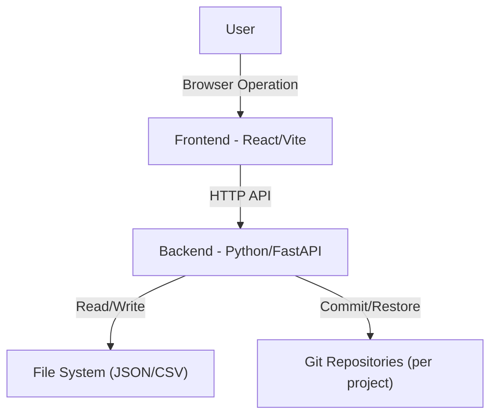
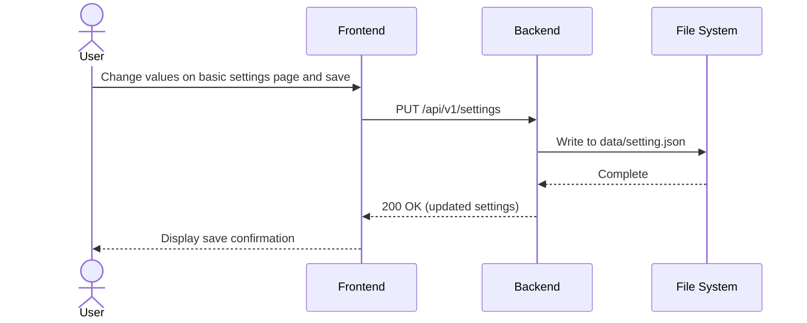
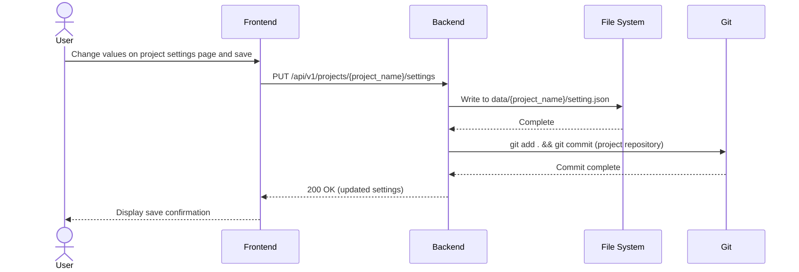
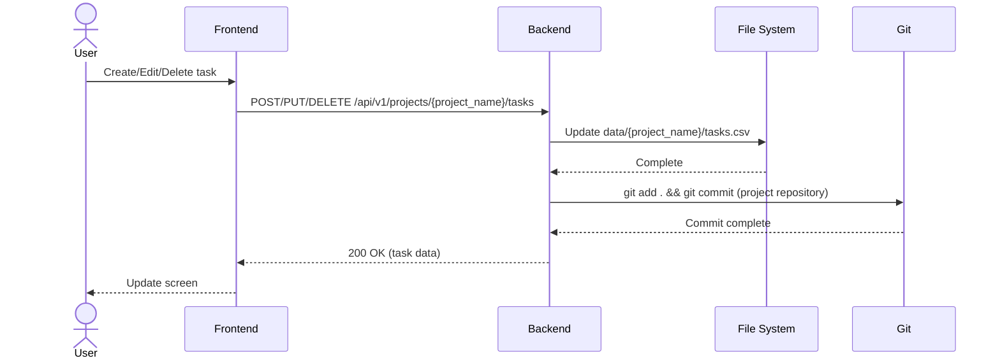
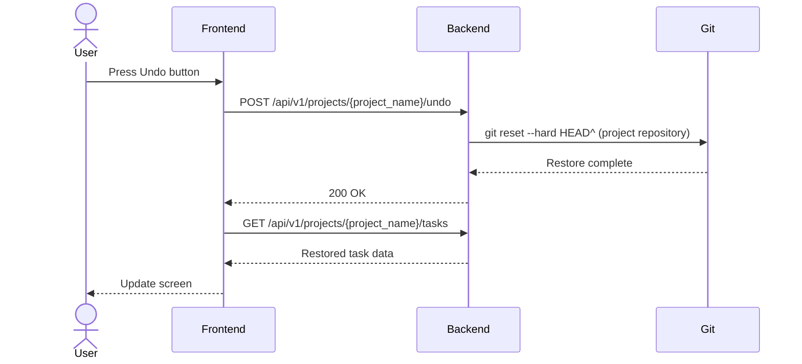
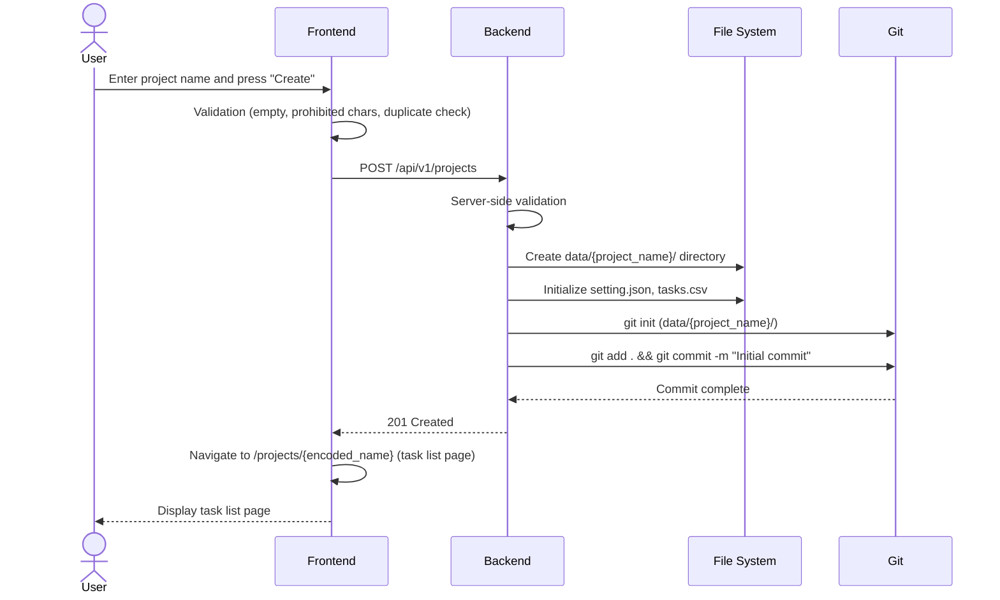

# System Design

## 1. System Overview

### 1.1 Background & Purpose

- **Background**: Addressing the need for offline availability and history management via Git.
- **Purpose**: To realize a robust and simple project management tool combining file-based (JSON/CSV) data management with Git-based history management.

### 1.2 Scope

- **In Scope**: This system (Frontend, Backend) and local data store.
- **Out of Scope**: Remote repository integration (Git is used functionally, but remote synchronization is up to user operation).

### 1.3 System Configuration



### 1.4 Directory Structure

```
data/
  setting.json          # Global basic settings (not under Git management)
  <project-name>/
    .git/               # Project-specific Git repository
    setting.json         # Project-specific settings (under Git management)
    tasks.csv            # Project-specific task data (under Git management)
```

## 2. Environment

- **Language**: TypeScript (Frontend), Python 3.12+ (Backend)
- **Framework**: React (Frontend), FastAPI (Backend)
- **Database**: None (Uses JSON/CSV files)
- **Infrastructure**: Supports Docker container execution or direct execution on local PC. Use Docker volumes to ensure persistence of data and history.

## 3. Functional Requirements

### 3.1 Configuration Management (CNFG)

- **Implementation Strategy**
  - Global basic settings are saved in JSON format at `data/setting.json`. Not under Git management.
  - Project-specific settings are saved in JSON format at `data/<project-name>/setting.json`. Under Git management.
  - Use Pydantic models for validation to prevent invalid configuration values.

- **Sequence Diagram (Save Basic Settings)**



- **Sequence Diagram (Save Project Settings)**



- **Requirement List**
  | Spec-ID | Category | Name | Item | Detail | Remarks |
  | :--- | :--- | :--- | :--- | :--- | :--- |
  | **SPEC-CNFG-001-001** | Config | Global Basic Settings | File Save | Store in `data/setting.json` in JSON format. Not under Git management. | REQ-CNFG-001, REQ-DATA-003 |
  | **SPEC-CNFG-001-002** | Config | Global Basic Settings | Model | Define `BasicSettings` class to manage task statuses, types, assignees etc. | REQ-CNFG-001 |
  | **SPEC-CNFG-001-003** | Config | Global Basic Settings | API | `GET /api/v1/settings` and `PUT /api/v1/settings` for retrieving and updating global basic settings. | REQ-CNFG-001 |
  | **SPEC-CNFG-002-001** | Config | Project Settings | File Save | Store in `data/<project-name>/setting.json`. Under Git management. | REQ-CNFG-002, REQ-DATA-002 |
  | **SPEC-CNFG-002-002** | Config | Project Settings | Override | Allow overriding global basic settings on a per-project basis. | REQ-CNFG-002 |
  | **SPEC-CNFG-002-003** | Config | Project Settings | API | `GET /api/v1/projects/{project_name}/settings` and `PUT /api/v1/projects/{project_name}/settings` for retrieving and updating project settings. Changes are Git committed. | REQ-CNFG-002, REQ-HIST-001 |

### 3.2 Task Management (TASK)

- **Implementation Strategy**
  - Task data is processed using `pandas` DataFrame and saved as CSV files within project directories.
  - Task IDs use UUID v4 to ensure uniqueness.
  - Hierarchical structure is represented by `parent_id` in each task data, and reconstructed into a tree structure on the frontend.
  - All task APIs receive the project name as a path parameter.

- **Sequence Diagram (Task Operations)**



- **Requirement List**
  | Spec-ID | Category | Name | Item | Detail | Remarks |
  | :--- | :--- | :--- | :--- | :--- | :--- |
  | **SPEC-TASK-001-001** | Task | Task List | API | `GET /api/v1/projects/{project_name}/tasks` reads from CSV and returns all task data for the specified project. | REQ-TASK-001 |
  | **SPEC-TASK-001-002** | Task | Task List | Filter | Filter by status, assignee etc. via query params or frontend. | REQ-TASK-001 |
  | **SPEC-TASK-002-001** | Task | Task Data | Data Format | Tasks are saved in `data/<project-name>/tasks.csv`. | REQ-TASK-004, REQ-DATA-002 |
  | **SPEC-TASK-002-002** | Task | Task Create | ID Gen | Automatically generate UUID v4 for ID on creation. | REQ-TASK-002 |
  | **SPEC-TASK-002-003** | Task | Task Create | API | `POST /api/v1/projects/{project_name}/tasks` creates a new task. Git commit after creation. | REQ-TASK-002, REQ-HIST-001 |
  | **SPEC-TASK-002-004** | Task | Task Edit | API | `PUT /api/v1/projects/{project_name}/tasks/{task_id}` updates a task. Git commit after update. | REQ-TASK-002, REQ-HIST-001 |
  | **SPEC-TASK-002-005** | Task | Task Delete | API | `DELETE /api/v1/projects/{project_name}/tasks/{task_id}` deletes a task. Git commit after deletion. | REQ-TASK-001, REQ-HIST-001 |
  | **SPEC-TASK-003-001** | Task | Hierarchy | Data Structure | Has `parent_id` column to hold parent task ID. | REQ-TASK-003 |
  | **SPEC-TASK-004-001** | Task | Task Reordering | API | `PUT /api/v1/projects/{project_name}/tasks/reorder` updates the `display_order` of multiple tasks at once. Git commit after update. | REQ-TASK-005, REQ-HIST-001 |

### 3.3 Visualization & Charts (VIEW)

- **Implementation Strategy**
  - Render using frontend libraries.
  - Data aggregation is performed in Backend or Frontend Service layer.

- **Requirement List**
  | Spec-ID | Category | Name | Item | Detail | Remarks |
  | :--- | :--- | :--- | :--- | :--- | :--- |
  | **SPEC-VIEW-001-001** | View | Gantt Chart | Logic | Render bars based on planned start/end dates. Parent covers child duration. | REQ-VIEW-001 |
  | **SPEC-VIEW-002-001** | View | Progress Line | Logic | Calculate delay/advance coordinates based on progress rate at base date. | REQ-VIEW-002 |
  | **SPEC-VIEW-003-001** | View | Auto Scheduling | Calculation Logic | Auto-calculate start/end dates based on priority, dependencies, man-hours, and holidays using topological sort and resource timeline management. | REQ-VIEW-003 |
  | **SPEC-VIEW-003-002** | View | Auto Scheduling | Productivity Adjustment | Adjust schedule by calculating effective man-hours (hours / productivity) using the assignee's `productivity_ratio`. | REQ-VIEW-003 |
  | **SPEC-VIEW-003-003** | View | Auto Scheduling | Intra-day & Gap Filling | Start the next task using remaining time within a day, and fill gaps (waiting time for high priority tasks) with lower priority tasks. | REQ-VIEW-003 |

### 3.4 History Management (HIST)

- **Implementation Strategy**
  - Issue `git add .`, `git commit` commands to the target project's Git repository immediately after data save operations.
  - Restore files to specific commit hash state in the target project's Git repository for Undo/Redo.
  - Git operations are executed with the project directory (`data/<project-name>/`) as the current directory.

- **Sequence Diagram (Undo/Redo)**



- **Requirement List**
  | Spec-ID | Category | Name | Item | Detail | Remarks |
  | :--- | :--- | :--- | :--- | :--- | :--- |
  | **SPEC-HIST-001-001** | History | Auto Commit | Trigger | Execute on successful completion of task add/update/delete and project settings update APIs, in the target project's Git repository. | REQ-HIST-001 |
  | **SPEC-HIST-001-002** | History | Auto Commit | Log | Include operation details (e.g., "Update Task A") in commit message. | REQ-HIST-001 |
  | **SPEC-HIST-002-001** | History | Manual Commit | Runtime Sync | Upon fetching task data, automatically commit if there are uncommitted changes in the target project's Git repository. | REQ-HIST-002 |
  | **SPEC-HIST-003-001** | History | Undo/Redo | Restore Logic | Restore using `git reset --hard` in the target project's Git repository. | REQ-HIST-003 |
  | **SPEC-HIST-003-002** | History | Undo | API | `POST /api/v1/projects/{project_name}/undo` executes Undo. | REQ-HIST-003 |
  | **SPEC-HIST-003-003** | History | Redo | API | `POST /api/v1/projects/{project_name}/redo` executes Redo. | REQ-HIST-003 |

### 3.5 Project Management (PROJ)

- **Implementation Strategy**
  - Projects are managed as subdirectories under the `data/` directory. Each directory corresponds to one project.
  - Project list is obtained from the directory listing under `data/`.
  - When creating a new project: create directory → Git init → initialize `setting.json`/`tasks.csv` → initial commit.
  - Project name validation is performed on both frontend and backend for directory name validity.

- **Sequence Diagram (Project Creation)**



- **Requirement List**
  | Spec-ID | Category | Name | Item | Detail | Remarks |
  | :--- | :--- | :--- | :--- | :--- | :--- |
  | **SPEC-PROJ-001-001** | Project | Project List | API | `GET /api/v1/projects` returns the list of projects (directories) under `data/`. | REQ-PROJ-001 |
  | **SPEC-PROJ-002-001** | Project | Project Create | API | `POST /api/v1/projects` receives a project name, creates directory, initializes Git, initializes files, and creates initial commit. | REQ-PROJ-002 |
  | **SPEC-PROJ-002-002** | Project | Project Create | Git Init | Execute `git init -b main` in the project directory, create initial commit including `setting.json` and `tasks.csv`. | REQ-PROJ-002, REQ-DATA-001 |
  | **SPEC-PROJ-003-001** | Project | Validation | Server-side | Return HTTP 400 error if project name is empty (after trim), contains OS-prohibited characters, or duplicates an existing project. | REQ-PROJ-003 |
  | **SPEC-PROJ-003-002** | Project | Validation | Client-side | Perform project name validation on the frontend before API call and display error messages immediately. | REQ-PROJ-003 |
  | **SPEC-PROJ-004-001** | Project | Auto Git Init | On Data Change | When a project's task is changed and no Git repository exists, perform Git init and initial commit on the pre-change state, then commit the change. | REQ-PROJ-004 |
  | **SPEC-PROJ-005-001** | Project | External Change Detection | On Data Load | When fetching task data, automatically commit if there are uncommitted changes in the project's Git repository. | REQ-PROJ-005 |

### 3.6 Common UI (UI)

- **Implementation Strategy**
  - Create `GlobalLayout` and `ProjectLayout` components to display context-appropriate menu bars.
  - Global context: Display links to "Project Management" and "Basic Settings".
  - Project context: Display links to "Project Management", "Task List", "Gantt Chart", "Project Settings", project switch dropdown, and Undo/Redo buttons.

- **Requirement List**
  | Spec-ID | Category | Name | Item | Detail | Remarks |
  | :--- | :--- | :--- | :--- | :--- | :--- |
  | **SPEC-UI-001-001** | UI | GlobalLayout | Component | Layout component for global context screens. Displays header with navigation to "Project Management" and "Basic Settings". | REQ-UI-001 |
  | **SPEC-UI-001-002** | UI | ProjectLayout | Component | Layout component for project context screens. Displays header with navigation to "Project Management", "Task List", "Gantt Chart", "Project Settings", project switch dropdown, and Undo/Redo buttons. | REQ-UI-002, REQ-UI-003, REQ-UI-004 |
  | **SPEC-UI-002-001** | UI | ProjectSelect | Project Select | Place a project switch dropdown list in the project context header. Navigate to `/projects/<encoded-name>` on selection. | REQ-UI-003 |
  | **SPEC-UI-003-001** | UI | Menu | Navigation | Place links to "Task List", "Gantt Chart", "Project Settings" in the project context header. | REQ-UI-002 |
  | **SPEC-UI-004-001** | UI | Menu | Undo/Redo | Place "Undo" and "Redo" buttons in the project context header, calling the target project's API on click. | REQ-UI-004 |

### 3.7 Routing (ROUTE)

- **Implementation Strategy**
  - Implement URL-based routing using React Router.
  - Use different layouts for global context and project context.
  - Project name is used as a URL-encoded path parameter.

- **Requirement List**
  | Spec-ID | Category | Name | Item | Detail | Remarks |
  | :--- | :--- | :--- | :--- | :--- | :--- |
  | **SPEC-ROUTE-001-001** | Route | Project Mgmt | Route Def | Display project management page at `/projects` and `/`. Use `GlobalLayout`. | REQ-ROUTE-001 |
  | **SPEC-ROUTE-002-001** | Route | Basic Settings | Route Def | Display basic settings page at `/settings`. Use `GlobalLayout`. | REQ-ROUTE-002 |
  | **SPEC-ROUTE-003-001** | Route | Task List | Route Def | Display task list page at `/projects/:projectName`. Use `ProjectLayout`. | REQ-ROUTE-003 |
  | **SPEC-ROUTE-004-001** | Route | Gantt Chart | Route Def | Display Gantt chart page at `/projects/:projectName/gantts`. Use `ProjectLayout`. | REQ-ROUTE-004 |
  | **SPEC-ROUTE-005-001** | Route | Project Settings | Route Def | Display project settings page at `/projects/:projectName/settings`. Use `ProjectLayout`. | REQ-ROUTE-005 |
